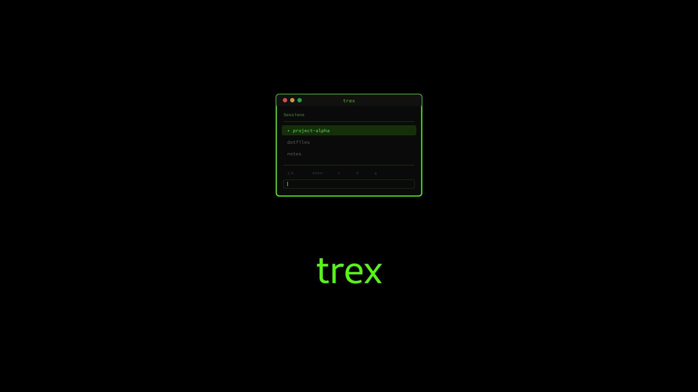
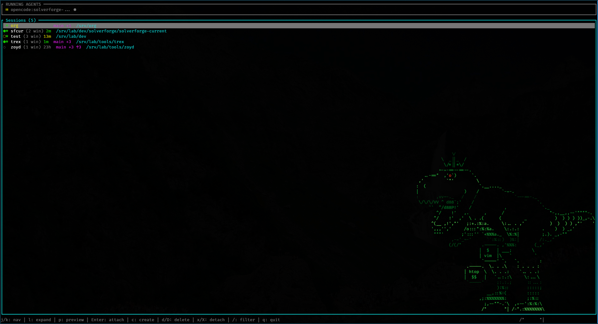



A fast, minimal tmux session manager with fuzzy finding and vim-like keybindings.




 Interactive TUI 
 Fuzzy Finding 
 Vim Keybindings 
 Zero Config 
 Open Source 


---

## Screenshots


  
  


---

## GitHub



---

## Installation

### Cargo Recommended

```bash
cargo install trex
```

The easiest way to install trex if you have Rust installed.

### Binary Download

Download the latest release from GitHub:

```bash
# Download
curl -LO https://github.com/blackopsrepl/trex/releases/latest/download/trex-linux-x86_64.tar.gz

# Extract
tar -xzf trex-linux-x86_64.tar.gz

# Install
sudo mv trex /usr/local/bin/
```


Pre-built binaries are statically linked for universal Linux compatibility.


### Build from Source

```bash
git clone https://github.com/blackopsrepl/trex
cd trex
cargo build --release
```

The binary will be at `target/release/trex`.

---

## Quick Start


**trex must be run from outside tmux.** If you try to run it from within a tmux session, it will exit with an error message.


```bash
# Just run it
trex
```

That's it. No configuration files needed.


**Zsh Keybinding** — Add this to your `.zshrc` to launch trex with `Ctrl+T`:

```zsh
trex-widget() {
  zle push-input
  BUFFER="trex"
  zle accept-line
}
zle -N trex-widget
bindkey '^T' trex-widget
```


---

## Features




Create, attach, delete, and detach tmux sessions with simple keyboard shortcuts. Navigate with vim-like keybindings.



Quickly filter sessions and directories with fuzzy matching. The same algorithm used by popular fuzzy finders, optimized for speed.



Discover directories across your filesystem with configurable depth (1-6 levels). Automatically prioritizes your current directory and common project locations.



Automatically preselects sessions matching your current working directory. First by exact path match, then by directory name.




---

## Keybindings

### Normal Mode

| Key | Action |
|-----|--------|
| `j` / `k` | Navigate down / up |
| `g` / `G` | Jump to first / last |
| `Enter` | Attach to session |
| `c` | Create new session (directory mode) |
| `d` | Delete selected session |
| `D` | Delete all sessions |
| `x` | Detach from selected session |
| `X` | Detach all clients |
| `/` | Enter filter mode |
| `q` / `Esc` | Quit |

### Directory Selection Mode

| Key | Action |
|-----|--------|
| `j` / `k` | Navigate directories |
| `g` / `G` | Jump to first / last |
| `Enter` | Create session in directory |
| `Tab` | Complete filter with path |
| `+` / `-` | Increase / decrease scan depth |
| `Esc` | Cancel and return |

### Filter Mode

| Key | Action |
|-----|--------|
| *Type* | Filter sessions/directories |
| `Backspace` | Delete character |
| `Esc` | Exit filter mode |

---

## Architecture


graph TD
    subgraph CLI["trex CLI"]
        A[main.rs]
    end

    subgraph TUI["TUI Module"]
        B[app.rs<br/>State & Logic]
        C[events.rs<br/>Key Handling]
        D[ui.rs<br/>Rendering]
    end

    subgraph TMUX["tmux Integration"]
        E[commands.rs<br/>TmuxClient]
        F[parser.rs<br/>Session Parser]
        G[session.rs<br/>TmuxSession]
    end

    subgraph DISCO["Directory Discovery"]
        H[directory.rs<br/>Filesystem Scan]
    end

    A --> B
    A --> E
    A --> H

    B --> C
    B --> D
    B -.-> |nucleo| I[Fuzzy Matching]

    E --> F
    E --> G

    D -.-> |ratatui| J[Terminal UI]
    D -.-> |crossterm| K[Raw Mode]


---

## Highlights


**Single binary, zero config** — Just run `trex` and start managing sessions. No configuration files, no setup, no dependencies.



**Blazingly fast** — Written in Rust with the `nucleo` fuzzy matching library. Handles thousands of directories instantly.



**Static builds** — Pre-built binaries are statically linked for universal Linux compatibility. No runtime dependencies.


---

## Tech Stack


 Rust 
 ratatui 
 crossterm 
 nucleo 
 anyhow 
 thiserror 


---

## Links


 View on GitHub



 Download Releases



 crates.io

