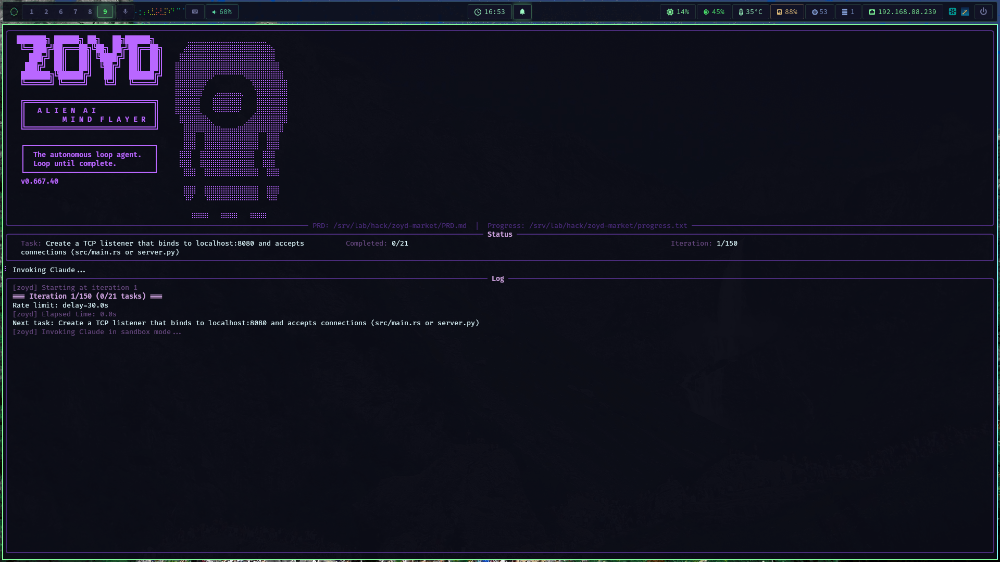
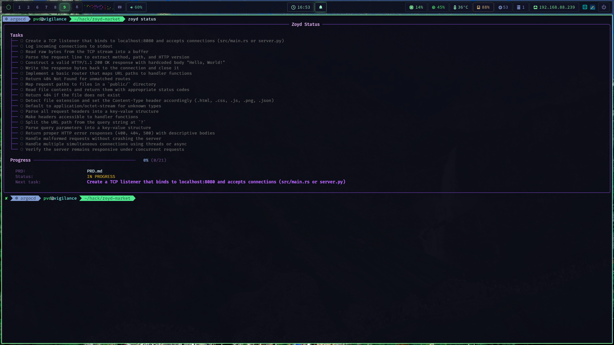



Point it at a PRD. Walk away. Come back to committed code.




 Autonomous Loop 
 PRD-Driven 
 Progress Tracking 
 Auto-Commit 
 Open Source 


---

## Screenshots


  
  


---

## Installation

```bash
git clone https://github.com/blackopsrepl/zoyd
cd zoyd
pip install -e .
```

---

## Quick Start

```bash
# Create a starter PRD
zoyd init "My Project"

# Edit PRD.md with your tasks, then run
zoyd run

# Check progress
zoyd status
```


**Minimal PRD** — Zoyd tracks markdown checkboxes. Write `- [ ] Do the thing` and it knows what to do.


---

## How It Works




Reads your PRD file and extracts `- [ ]` / `- [x]` tasks. Tracks completion status and line numbers for precise updates.



Builds a prompt with PRD content, progress history, and iteration context. Invokes Claude Code with full codebase access.



Appends output to the progress log, auto-commits completed tasks, and loops back. Stops when all checkboxes are checked or limits are hit.



Real-time progress tracking with spinners, task status, iteration count, and cost monitoring in a terminal dashboard.




---

## Architecture


graph TD
    subgraph INPUT["Input"]
        A["PRD.md<br/>Task Checkboxes"]
    end

    subgraph CORE["Zoyd Loop"]
        B[Task Parser]
        C[Loop Runner]
        D[Progress Logger]
    end

    subgraph AI["AI Backend"]
        E["Claude Code<br/>--print --permission-mode acceptEdits"]
    end

    subgraph OUTPUT["Output"]
        F[Auto Commit]
        G[Git Repository]
        H[Rich TUI]
    end

    A --> B
    B --> C
    C --> E
    E --> D
    D --> B

    C --> F
    F --> G
    C --> H


---

## Configuration

Zoyd reads `zoyd.toml` from your project directory. CLI flags override config values.

```toml
prd = "PRD.md"
max_iterations = 10
model = "sonnet"
max_cost = 10.0
auto_commit = true
tui_enabled = true
storage_backend = "redis"
```


**Storage backends** — File-based logging by default, or Redis for persistent session state and vector semantic memory.


---

## Highlights


**Fully autonomous** — Zoyd invokes Claude Code in a loop, tracking progress and committing changes until every task in your PRD is checked off.



**Cost-aware** — Set a dollar budget with `--max-cost`. Zoyd stops before you burn through tokens.



**Sandboxed by default** — Runs Claude Code with `acceptEdits` permissions. Use `--rabid` to go unrestricted.


---

## Tech Stack


 Python 
 Claude Code 
 Rich 
 Textual 
 Redis 
 Click 


---

## Links


 View on GitHub



